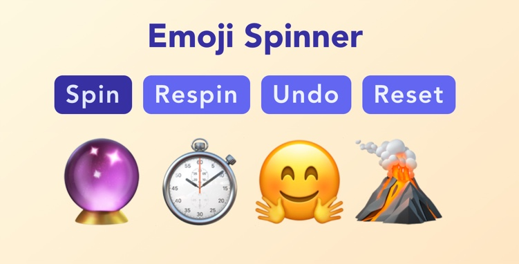

# emoji-spinner

A teacher friend wants to use random emoji as story-writing prompts, so this is a website that lets you reveal random emoji one at a time.

## Usage

There are several buttons:

* **Spin**: Pick the next random emoji
* **Respin**: If you don't last the last picked emoji, pick a fresh one
* **Undo**: Remove the last picked emoji
* **Restart**: Remove all the emoji

The Emoji Spinner shows up to five emoji.

## Technical

Built with Vue 3, TailwindCSS, and Vite.
